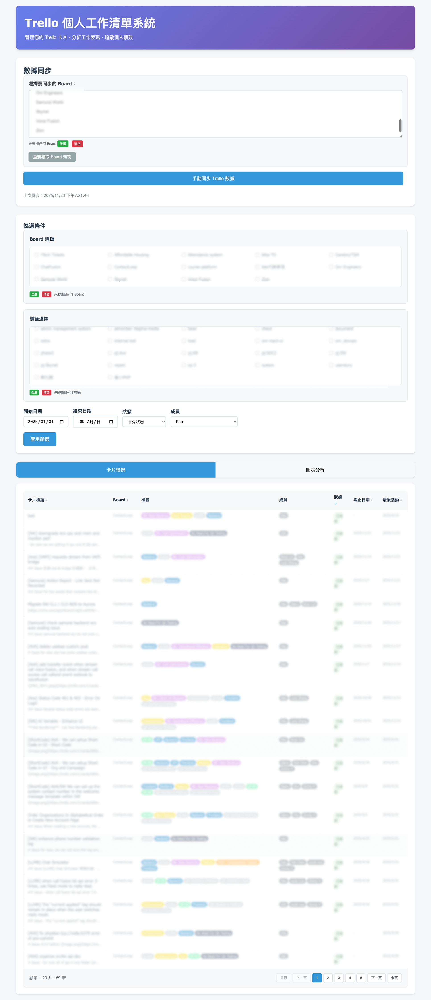
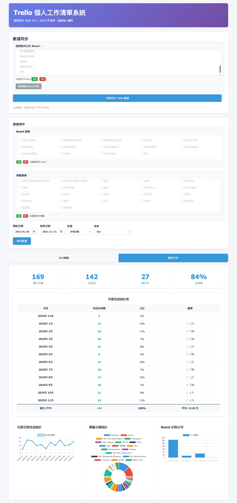

# Trello 個人工作清單系統

一個基於 Bun 和 Elysia 的個人 Trello 工作清單管理系統，用於管理大量 Trello 卡片、提供多維度篩選和統計分析功能。

## 功能特色

- ✅ 手動同步 Trello 數據到本地
- ✅ 選擇性同步特定 Board（新功能）
- ✅ 離線瀏覽已同步的卡片
- ✅ 多維度篩選（Board、時間、狀態）
- ✅ 圖表統計分析（月度、標籤、Board）
- ✅ 響應式界面設計
- ✅ 本地數據備份機制

## 安裝和設置

### 1. 環境需求

- [Bun](https://bun.sh/) >= 1.0
- Node.js >= 18 (備用)

### 2. 安裝依賴

```bash
bun install
```

### 3. 環境配置

1. 複製環境變數範例檔案：
```bash
cp .env.example .env
```

2. 編輯 `.env` 檔案，設定您的 Trello API 憑證：

```env
TRELLO_API_KEY=your_trello_api_key
TRELLO_TOKEN=your_trello_token
PORT=3000
```

#### 如何取得 Trello API 憑證：

1. 前往 [Trello Developer](https://trello.com/app-key) 取得 API Key
2. 使用以下 URL 取得 Token（替換 YOUR_API_KEY）：
   ```
   https://trello.com/1/authorize?expiration=never&scope=read&response_type=token&name=Server%20Token&key=YOUR_API_KEY
   ```

## 使用方式

### 1. 啟動伺服器

開發模式（熱重載）：
```bash
bun run dev
```

生產模式：
```bash
bun run start
```

### 2. 訪問應用

開啟瀏覽器訪問：http://localhost:3000

### 3. 同步數據

1. 點擊「手動同步 Trello 數據」按鈕
2. 等待同步完成
3. 即可開始使用篩選和分析功能

## 功能說明

### 數據同步

- **手動同步**：點擊同步按鈕從 Trello 獲取最新數據
- **離線使用**：同步後的數據儲存在本地，可離線瀏覽
- **增量更新**：支援更新現有卡片和新增卡片

### 篩選功能

- **Board 篩選**：按照不同的 Trello Board 篩選卡片
- **時間範圍**：選擇特定的開始和結束日期
- **完成狀態**：篩選已完成或進行中的卡片

### 圖表分析

1. **統計卡片**：顯示總數、完成數、進行中、完成率
2. **月度趨勢**：線圖顯示每月任務完成情況
3. **標籤分析**：圓餅圖顯示不同標籤的任務分布
4. **Board 分析**：柱狀圖顯示各 Board 的任務數量

## 項目結構

```
trello-work-list/
├── src/
│   ├── index.ts          # 主服務器文件
│   ├── trello.ts         # Trello API 服務
│   └── storage.ts        # 本地數據存儲
├── public/
│   ├── index.html        # 前端界面
│   └── app.js            # 前端 JavaScript
├── data/
│   ├── cards.json        # 卡片數據（自動生成）
│   └── cards_backup.json # 數據備份（自動生成）
├── package.json
├── .env.example
├── .gitignore
└── README.md
```

## API 端點

- `GET /api/last-sync` - 獲取最後同步時間
- `GET /api/boards` - 獲取所有 Board
- `GET /api/cards` - 獲取卡片（支援篩選參數）
- `POST /api/sync` - 手動同步 Trello 數據

## 數據安全

- API 憑證儲存在 `.env` 檔案中（已加入 .gitignore）
- 本地數據自動備份
- 同步失敗時會保留原有數據

## 故障排除

### 同步失敗

1. 檢查 `.env` 檔案中的 API 憑證是否正確
2. 確認網路連線正常
3. 檢查 Trello API 配額是否已用完

### 無法訪問應用

1. 確認端口 3000 沒有被其他服務占用
2. 檢查防火牆設定
3. 查看控制台是否有錯誤信息

### 數據遺失

1. 檢查 `data/cards_backup.json` 備份文件
2. 重新同步數據
3. 聯繫開發者支援

## 技術架構

- **後端**：Bun + Elysia
- **前端**：原生 HTML/CSS/JavaScript
- **圖表**：Chart.js
- **數據存儲**：本地 JSON 檔案
- **API**：Trello REST API

## 畫面




## 授權

MIT License

## 貢獻

歡迎提交 Issue 和 Pull Request！

## 更新日誌

### v1.0.0
- 初始版本發布
- 實現基本的 Trello 同步功能
- 提供篩選和圖表分析功能
- 支援離線使用